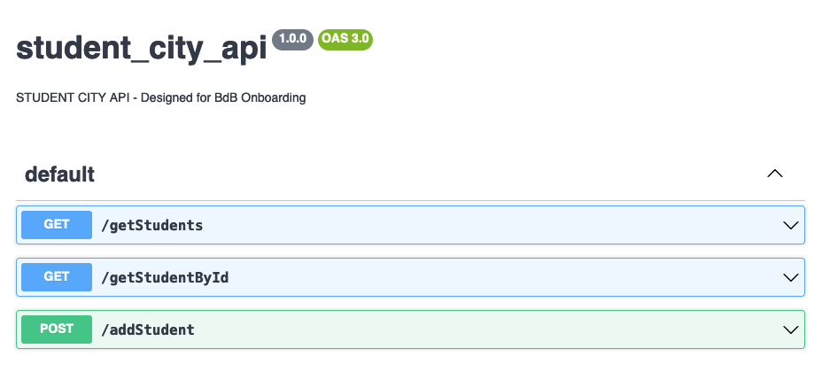
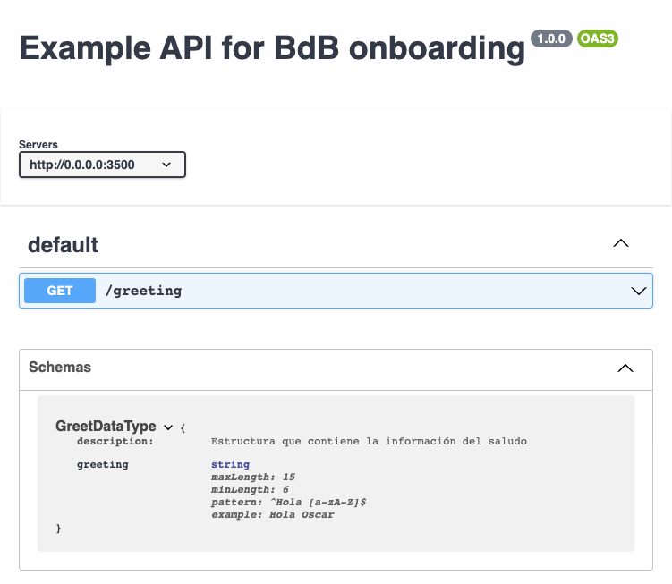
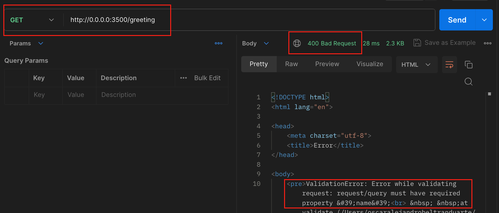
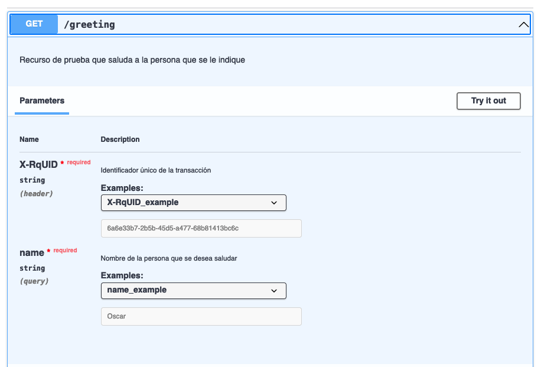
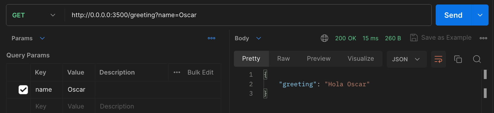

# student_city_mngr

Este proyecto está construido sobre **Node.js** en su versión **v18.16.0** y **npm** en su versión **9.5.1** por ende, se requiere la instalación de esta versión para poder ejecutar el proyecto.

## ¿Cómo ejecuto este proyecto?

Una vez preparado el ambiente local, se procede a descargar las dependencias con el siguiente comando:

### Instalar dependencias
```sh
npm i
```

Y se inicia el proyecto con el comando:

### Ejecutar el proyecto
```sh
npm run dev
```

Adicionalmente, si se desea, se pueden ejecutar las pruebas end-to-end con el comando:

### Ejecutar pruebas e2e
```sh
npm run test
```

## ¿Y ahora qué?

El objetivo de este ejercicio es darle continuidad al tema del onboarding '[OAS - OpenAPI Specification](https://bancodebogotaconfluence.atlassian.net/wiki/spaces/LABDIGITAL/pages/3307077766/Checklist+Onboarding+Desarrollo+Digital#OAS---OpenAPI-Specification)'.

En concreto, se espera que se aprenda a **leer** e **interpretar** el contrato [student_city_api_OAS.json](./static/student_city_api_OAS.json) y, por medio de herramientas como _Postman_, se haga el consumo **exitoso** de los distintos recursos descritos en el mismo.

Para ello se puede usar [Swagger Editor](https://editor.swagger.io/), una página que permite cargar OAS y visualizarlos de manera mucho más amigable, como se puede ver en la siguiente imagen:



Es importante indicar que la visualización dada por **Swagger Editor** es solo una ayuda, no muestra toda la información del contrato y se insta a la persona a revisarlo en paralelo con la idea de identificar todas las condiciones y requerimientos definidos.

Ahora, después de leerlo y conocer los requisitos para consumir los servicios, se deben construir las consultas REST **siguiendo las pautas que indica el contrato**, de no cumplirse se obtendrá un error '**ValidationError**' en el siguiente formato:

```html
<!DOCTYPE html>
<html lang="en">

<head>
	<meta charset="utf-8">
	<title>Error</title>
</head>

<body>
	<pre>ValidationError: Error while validating request: [OMITIDO]</pre>
</body>

</html>
```

Acompañado de un código de error **400 Bad Request**, comportamiento no deseado, pues lo que se busca es obtener resultados exitosos, tal como se evidencia en el siguiente ejemplo.

# Ejemplo
Este proyecto cuenta con un [contrato adicional](./static/example_OAS.json) que se usará para explicar brevemente el objetivo de esta práctica.

1. Se abre el contrato en **Swagger Editor** y se observa lo siguiente:
	- El servicio está expuesto en la dirección **http://0.0.0.0:3500**
	- Se expone un único recurso: **/greetings**
	- Es un **GET**	

Tal como se ve en la siguiente imagen



2. Si se intenta consumir el servicio usando únicamente esa info, se obtiene lo siguiente
	- Un **ValidationError 400 Bad Request**
	- Un mensaje indicando que se requiere la propiedad 'name'

Tal como se ve en la siguiente imagen


3. Al abrir la definición del servicio **/greeting** se puede ver que:
	- Requiere un parámetro query de nombre **name**
	- Adicionalmente está esperando una cabecera llamada **X-RqUID**
	- Ambos datos son obligatorios



4. Si ahora se consume el servicio con la nueva información que se extrajo del contrato se obtiene como resultado una respuesta exitosa:



Cabe mencionar que en el contrato se definen muchas más condiciones, como por ejemplo que el nombre no exceda cierto número de caracteres pero con fines del ejemplo solo se llegará a este nivel.

Por supuesto, se espera que en la práctica real se puedan identificar y entender la mayor cantidad de estos requisitos.
